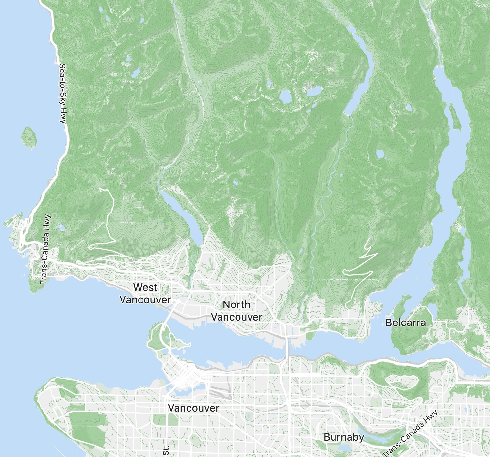

## vectorvector

vectorvector provides tooling for vectorizing the planet.
Produces contour tiles, hillshade and terrarium tiles from an elevation data set.

## Features

Provides a command-line tool for generating slippy map tiles from elevation data.

### Tile Outputs

* **Hillshade** - raster hillshade using the Horn Algorithm[^1]
* **Contour Lines** - vector contour lines using the Marching Squares algorithm[^2]. Contour lines are reduced using the
  Ramer–Douglas–Peucker algorithm[^6][^7]
* **Terrarium Tiles** - raster elevation tiles in Terrarium format[^3]

### Elevation Inputs

* SRTM[^4] elevation data in GeoTIFF[^5] format. Tested using data
  from [srtm.csi.cgiar.org](https://srtm.csi.cgiar.org/)

## Build

To build the package, use the following command:

```shell
$ mvn package
```

The build creates a jar with all dependencies in `target/vectorvector-cli.jar`

## Usage

Sample usage:

```shell
$ java -jar target/vectorvector-cli.jar --outputFormat files --data elevation/data/tif --output elevation/output --area pnw --vector=true --hillshadeRaster=true   
```

In this example `pnw` refers to the Pacific Northwest

Running with `--help` will generate usage help:

```txt
java -jar target/vectorvector-cli.jar  --help
Usage: java --jar vectorvector-cli.jar [-h] [--hillshadeRaster] [--terrarium]
                                       [--validate] [--vector] [-a=<area>]
                                       -d=<dataDir>
                                       [--epsilon=<contourEpsilon>]
                                       -f=<outputFormat> [-maxX=<maxX>]
                                       [-maxY=<maxY>] [-maxZ=<maxZ>]
                                       [-minX=<minX>] [-minY=<minY>]
                                       [-minZ=<minZ>] -o=<outputDir>
  -a, --area=<area>          The name of an area, which specifies a bounds for
                               tile generation (minZ, maxZ, minX, maxX, minY,
                               maxY). If specified, the area supersedes all
                               Z/X/Y options. Must be one of wholeworld, world,
                               northamerica, southamerica, europe, vancouver,
                               deepcove, pnw, sanfrancisco, newyork, paris,
                               rome, tokyo, palma
  -d, --data=<dataDir>       The data directory containing elevation data in
                               GeoTIFF format.
      --epsilon=<contourEpsilon>
                             Specifies the epsilon value to apply to contour
                               lines for reducing the number of points using
                               the Ramer–Douglas–Peucker algorithm. A higher
                               value simplifies the lines more by removing
                               points, while a lower value retains more detail.
                               The default value is 3. Set to 0 to disable line
                               simplification.
  -f, --outputFormat=<outputFormat>
                             The format of the output, must be one of files,
                               mbtiles
  -h, --help                 display this help message
      --hillshadeRaster      Generates hillshade raster tiles, which simulate
                               the shading effects of the sun on the terrain to
                               enhance visual representation of elevation data.
                               Defaults to true
      -maxX=<maxX>           Specifies the maximum longitude (X coordinate) for
                               the tile area at the minZ zoom level. Defaults
                               to 63
      -maxY=<maxY>           Specifies the maximum latitude (Y coordinate) for
                               the tile area at the minZ zoom level. Defaults
                               to 43
      -maxZ=<maxZ>           The maximum zoom level for which tiles are
                               generated. Defaults to 12
      -minX=<minX>           Specifies the minimum longitude (X coordinate) for
                               the tile area at the minZ zoom level. Defaults
                               to 63
      -minY=<minY>           Specifies the minimum latitude (Y coordinate) for
                               the tile area at the minZ zoom level. Defaults
                               to 13
      -minZ=<minZ>           The minimum zoom level for which tiles are
                               generated. Defaults to 6
  -o, --output=<outputDir>   Specifies the directory where the generated output
                               files will be saved. Defaults to .
      --terrarium            Generates Terrarium-style raster tiles, commonly
                               used for rendering 3D-like terrain features.
                               Defaults to false
      --validate              Validates the elevation data can be read before
                               generating tiles. The command exits without
                               generating output if validation fails. Defaults
                               to false
      --vector               Generates vector tiles with contour lines.
                               Defaults to true
```

### Disk Space

Approximate disk space requirements:

* GeoTIFF elevation data of the planet: 59G
* mbtiles output (vector and hillshade): 67G

You'll need a total of about 126 GB free space before starting, or about 200 GB if you're also generating pmtiles.

### Alternate Formats

To convert mbtiles to [pmtiles](https://docs.protomaps.com/pmtiles/):

```sh
$ brew install pmtiles
$ pmtiles convert world-hillshade.mbtiles world-hillshade.pmtiles
```

## Benchmark

Vector contour lines and raster hillshade for the world completed in 6 hours 51 minutes.
The process run on an Apple MacBook Pro with an M2 chip having 12 cores and 64 GB RAM.

| file              | size    |
|-------------------|---------|
| hillshade.mbtiles | 15.5 GB |
| vector.mbtiles    | 51.2 GB |

Command line options:

```txt
-Xmx42g
--outputFormat mbtiles --data data/tif --output output --area world --epsilon 3 --vector=true --hillshadeRaster=true
```

Machine spec:

```txt
Model Name: MacBook Pro
Model Identifier: Mac14,5
Chip:	Apple M2 Max
Total Number of Cores: 12 (8 performance and 4 efficiency)
Memory: 64 GB
```

## Example



Vector styling included the following for hillshade and contour lines:

<details><summary>(click to expand JSON style)</summary>

```json

{
  "layers": [
    {
      "id": "hillshade",
      "type": "raster",
      "source": "hillshade",
      "source-layer": "hillshade",
      "minzoom": 6,
      "maxzoom": 15,
      "paint": {
        "raster-opacity": [
          "interpolate",
          [
            "linear"
          ],
          [
            "zoom"
          ],
          6,
          0.8,
          11,
          0.4,
          14,
          0.2,
          15,
          0.1
        ]
      }
    },
    {
      "id": "contour_major",
      "type": "line",
      "source": "contour",
      "source-layer": "contours",
      "minzoom": 9,
      "maxzoom": 15,
      "filter": [
        "all",
        [
          ">",
          "ele",
          10
        ],
        [
          "==",
          "level",
          1
        ]
      ],
      "paint": {
        "line-color": "#66bb6a",
        "line-width": {
          "stops": [
            [
              12,
              0.5
            ],
            [
              13,
              1
            ]
          ]
        }
      }
    },
    {
      "id": "contour_medium",
      "type": "line",
      "source": "contour",
      "source-layer": "contours",
      "minzoom": 9,
      "maxzoom": 15,
      "filter": [
        "all",
        [
          ">",
          "ele",
          10
        ],
        [
          "==",
          "level",
          0
        ]
      ],
      "paint": {
        "line-color": "#81c784",
        "line-width": {
          "stops": [
            [
              10,
              0.25
            ],
            [
              11,
              0.5
            ],
            [
              16,
              1
            ]
          ]
        }
      }
    }
  ]
}
```

</details>

## Why

vectorvector is an experiment to see if we can produce high quality tiles for the whole planet in a few hours.

Goals:

* high quality output
* can generate the planet in < 6 hours on consumer hardware
* high degree of customizability
* optimal development experience with a fast feedback loop
* facilitate learning about mapping and algorithms

## See Also

The following tools and libraries provide complimentary functionality:

* [protomaps](https://github.com/protomaps)
* [planetiler](https://github.com/onthegomap/planetiler)
* [tippecanoe](https://github.com/felt/tippecanoe)

## Alternatives

The following tools and libraries are more mature,
have more features and may be more suited to your use-case:

* QGIS [github.com/qgis/QGIS](https://github.com/qgis/QGIS)
* GDAL (Geospatial Data Abstraction Library) [github.com/OSGeo/GDAL](https://github.com/OSGeo/GDAL)
* GRASS GIS [github.com/OSGeo/grass](https://github.com/OSGeo/grass)
* SAGA GIS [sourceforge.net/projects/saga-gis/](https://sourceforge.net/projects/saga-gis/)
* [github.com/jblindsay/whitebox-tools](https://github.com/jblindsay/whitebox-tools) "An advanced geospatial data
  analysis platform"
* [github.com/nst-guide/terrain](https://github.com/nst-guide/terrain) "Generate contours, hillshade, Terrain RGB,
  slope-angle shading tiles from elevation data."

## License

```txt
BSD 3-Clause License

Copyright (c) 2024, David Green

Redistribution and use in source and binary forms, with or without
modification, are permitted provided that the following conditions are met:

1. Redistributions of source code must retain the above copyright notice, this
   list of conditions and the following disclaimer.

2. Redistributions in binary form must reproduce the above copyright notice,
   this list of conditions and the following disclaimer in the documentation
   and/or other materials provided with the distribution.

3. Neither the name of the copyright holder nor the names of its
   contributors may be used to endorse or promote products derived from
   this software without specific prior written permission.

THIS SOFTWARE IS PROVIDED BY THE COPYRIGHT HOLDERS AND CONTRIBUTORS "AS IS"
AND ANY EXPRESS OR IMPLIED WARRANTIES, INCLUDING, BUT NOT LIMITED TO, THE
IMPLIED WARRANTIES OF MERCHANTABILITY AND FITNESS FOR A PARTICULAR PURPOSE ARE
DISCLAIMED. IN NO EVENT SHALL THE COPYRIGHT HOLDER OR CONTRIBUTORS BE LIABLE
FOR ANY DIRECT, INDIRECT, INCIDENTAL, SPECIAL, EXEMPLARY, OR CONSEQUENTIAL
DAMAGES (INCLUDING, BUT NOT LIMITED TO, PROCUREMENT OF SUBSTITUTE GOODS OR
SERVICES; LOSS OF USE, DATA, OR PROFITS; OR BUSINESS INTERRUPTION) HOWEVER
CAUSED AND ON ANY THEORY OF LIABILITY, WHETHER IN CONTRACT, STRICT LIABILITY,
OR TORT (INCLUDING NEGLIGENCE OR OTHERWISE) ARISING IN ANY WAY OUT OF THE USE
OF THIS SOFTWARE, EVEN IF ADVISED OF THE POSSIBILITY OF SUCH DAMAGE.
```

## References

[^1]: **Horn, B. K. P. (1981)**. "Hill shading and the reflectance map." Proceedings of the IEEE, 69(1), 14-47.
https://people.csail.mit.edu/bkph/papers/Hill-Shading.pdf

[^2]: "Marching Squares," *Wikipedia*, https://en.wikipedia.org/wiki/Marching_squares

[^3]: **Kelso, N. V., & Amos, M. (2016, October 11)**. "Mapzen Terrain Tiles are 1.0 and ready to go."
Mapzen. https://mapzen.com/blog/terrain-tile-service

[^4]: **Farr, T. G., et al. (2007)**. *The Shuttle Radar Topography Mission.* Reviews of Geophysics, 45(2).
DOI: [10.1029/2005RG000183](https://doi.org/10.1029/2005RG000183).

[^5]: **Open Geospatial Consortium (OGC)**. "GeoTIFF Standard, Version 1.1." OGC
19-008r4. https://www.ogc.org/standards/geotiff

[^6]: **Ramer, U. (1972)**. "An iterative procedure for the polygonal approximation of plane curves." Computer Graphics
and Image Processing, 1(3), 244–256.
DOI: 10.1016/S0146-664X(72)80017-0

[^7]: **Douglas, D., & Peucker, T. (1973)**. "Algorithms for the reduction of the number of points required to represent
a digitized line or its caricature." The Canadian Cartographer, 10(2), 112–122.
DOI: 10.3138/FM57-6770-U75U-7727